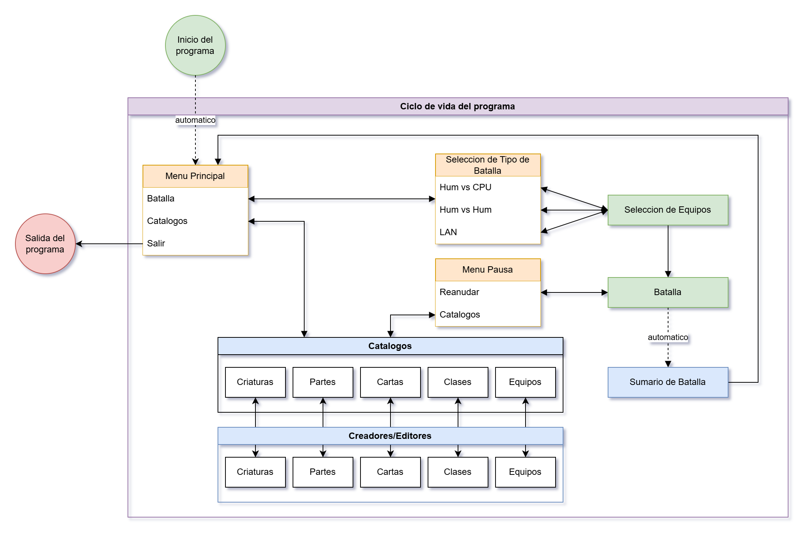
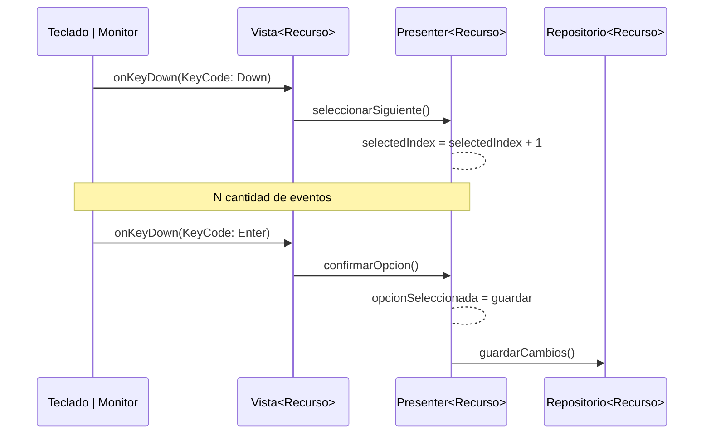

# Emberlords

Simulador de batallas de criaturas personalizables, por turnos, y dec builder.

# Diseño del proyecto
El proyecto esta diseñado con el patron de diseño MVP para separar lo que es el mostrado de las pantallas de la logica del juego en si.

Para mostrar las pantallas se decidió usar lanterna porque es muy simple y corre en cualquier sistema operativo.

## Patrones de Diseño utilizados

| Patron                                                                    | De Tipo    | Dónde se utiliza                                                                                                                                                                                                                                                                                                                                                                                                                                                                                                               |
|---------------------------------------------------------------------------|------------|--------------------------------------------------------------------------------------------------------------------------------------------------------------------------------------------------------------------------------------------------------------------------------------------------------------------------------------------------------------------------------------------------------------------------------------------------------------------------------------------------------------------------------|
| [State](https://refactoring.guru/design-patterns/state)                   | Behavioral | Se utiliza con las pantallas, permitiendo cambiar de una pantalla a otra, volver a la anterior etc. por ejemplo, si se quiere ver el catalogo de cartas mientras se está en pelea, al volver a la pantalla de pelea el resultado deseado es continuar con la pelea y no empezar desde el comienzo. Esto no podría ser posible con el patron de Strategy ya que este patron no permite el conocimiento entre diferentes Strategy. El patron State dice que un estado X puede hacer transiciones a un estado Y si este quisiera. |
| [Command](https://refactoring.guru/design-patterns/command)               | Design     | Se va a utilizar para cada uso de carta en las batallas, para poder tener un historial de lo que va pasando.                                                                                                                                                                                                                                                                                                                                                                                                                   |
| [Iterator](https://refactoring.guru/design-patterns/iterator)             | Design     | Se va a utilizar para reproducir una batalla que fue guardada, para ir avanzando en la linea de tiempo del uso de las cartas.                                                                                                                                                                                                                                                                                                                                                                                                  |
| [Memento](https://refactoring.guru/design-patterns/memento)               | Design     | Se va a utilizar para guardar batallas en un momento dado, y para poder restaurarlas para continuarlas mas adelante.                                                                                                                                                                                                                                                                                                                                                                                                           |
| [Strategy](https://refactoring.guru/design-patterns/template-method)      | Design     | Se va a utilizar para modificar los efectos al usar las cartas.                                                                                                                                                                                                                                                                                                                                                                                                                                                                |
| [Factory Method](https://refactoring.guru/design-patterns/factory-method) | Creational | Se utiliza en PantallaFactory, permite crear las diferentes pantallas, encapsulando la logica de creacion y pasado de parametros al constructor. Permite crear Pantallas sin conocer sus dependencias internas.                                                                                                                                                                                                                                                                                                                |                                                                                                                                                                                                                                                                                                

## ¿Cómo se usa Lanterna en este proyecto?

En vez de leer Strings del scanner, se leen KeyStroke de Lanterna, y en vez de escribir en la consola con `System.out.println` se dibuja a la `screen` directamente.

El proyecto esta fragmentado en diferentes "pantallas" con el patron State, esto permite intercambiar los menu y no perder la informacion o el estado.

Las pantallas se intercambian en tiempo de ejecucion para brindar una experiencia rica y dinamica.

## Pantallas y transiciones

Las pantallas son las <u>vistas</u> de la implementación del modelo **MVP**.

Las vistas se construyen con un <u>presenter</u> y estos se comunican eventos en particular.

# Interacciones entre las partes del modelo MVP:

| Actividad            | ...al monitor    | ...a la vista                 | ...al Presenter         | ...al repositorio       |
|----------------------|------------------|-------------------------------|-------------------------|-------------------------|
| Teclado envia...     | ---              | KeyCodes (Input crudo)        | ---                     | ---                     |
| Vista envia...       | Dibujado y texto | ---                           | Eventos UI particulares | ---                     |
| Presenter envia...   | ---              | Datos primitivos para mostrar | ---                     | Entidades ó solicitudes |
| Repositorio envia... | ---              | ---                           | Entidades               | ---                     | 

